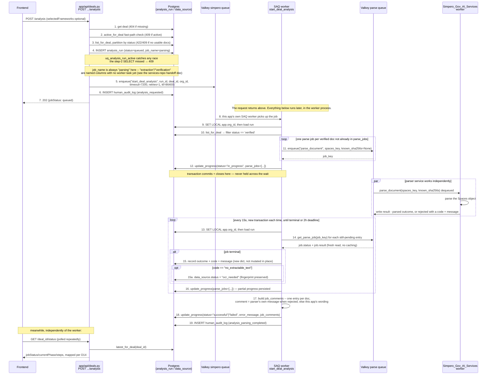

# Start Analysis → Parse Fan-Out — Implementation Summary

**Status:** Implemented, verified against a real Postgres/Valkey stack (`docker-compose.dev.yml`), not yet committed to git (working tree only as of this writing).
**Plan followed:** `docs/plans/start-analysis-flow-alpha.md` — that doc's "Verified findings" and "Architectural decisions" (D1–D17) are the design rationale; this doc is what actually shipped, one decision the plan left open, and how the two Valkey queues are actually used end to end.
**Session:** 2026-08-10.

---

## What this feature is

Replaces the dead `/api/simpero/analyse` call the frontend's Step 3 ("Start Analysis") used to make. `POST /api/deals/{deal_id}/analysis` now takes a `dealId`, creates an `analysis_run` row, and enqueues a worker task on this app's own Valkey queue. That task fans the deal's already-verified documents out to the parser service's (`Simpero_Gov_AI_Services`) Valkey queue, waits for every parse to finish, and reports the outcome back onto `analysis_run` (and, for scanned/unreadable documents, onto `data_source.status`) so `GET /deals/{deal_id}/status` can report real progress instead of the permanent `no_job` stub.

Nothing changed in `Simpero_Gov_AI_Services` — its `parse_document` consumer function and its two result-dict shapes were already exactly what this needed.

---

## The one open decision, closed

The plan flagged a blocking DDL choice: `data_source`'s one-way status trigger (added when SIM-216/218 shipped) rejected any UPDATE once a row left `pending`, which meant the parser's `no_extractable_text` signal (SIM-350) could never legally write `verified → ocr_needed`. Two options were laid out (Option A: relax the trigger to allow that one additional edge; Option B: skip the DB write, record the signal only in `analysis_run.parse_jobs`). **Vansh chose Option A.** `alembic/versions/92fda2e2a5db_data_source_ocr_needed_transition.py` replaces the trigger function body: `pending → anything` is still allowed (existing behavior, unchanged), `verified → ocr_needed` is now also allowed, everything else still raises. Still enforced against every role including the table owner — this is a narrowing of what's *rejected*, not a reopening of the lifecycle.

---

## Column/vocabulary revisions (same session, before anything shipped)

Four changes made after the initial build, all edited directly into the not-yet-committed `3fd6292e23f0_analysis_run.py` migration rather than layered on as separate migrations (nothing had shipped yet, so there was no reason to carry the churn forward):

- **`created_at` → `started_at`, plus a new `ended_at`.** `started_at` keeps `created_at`'s original behavior (`not null`, `server_default now()`) under a name that says what it actually represents for this table — when the run started. `ended_at` is new: nullable, no server default, stamped exactly once — server-side, via `func.now()` inside `AnalysisRunRepo.update_progress` — the moment `status` is set to a terminal value. Added to the table's `GRANT UPDATE (...)` list; `started_at` stays append-only, same as `created_at` did.
- **`analysis_run.status`'s four values renamed:** `queued` (unchanged) → `queued`, `parsing` → `in_progress`, `parsed` → `successful`, `failed` (unchanged) → `failed`. This is `analysis_run.status` only — two adjacent, easily-confused vocabularies were deliberately left alone:
  - The **UI phase name** `"parsing"` (`app/services/pipeline_steps.py`, one of the 9 frontend-mirrored phases, surfaced as `DealStatusResponse.currentPhase`) — unrelated to the run's own status column, untouched.
  - The **parser service's own per-document result vocabulary** (`parse_jobs[].outcome`, literally `"parsed"`/`"rejected"`, coming straight from `Simpero_Gov_AI_Services`' response dict) — an external contract this app must match verbatim, untouched.
- **New `job_comments` column (JSONB, nullable).** Requested directly: a frontend-facing findings summary, distinct from `parse_jobs`' internal bookkeeping shape (`job_key`/`bucket`/`key`, snake_case, never meant to leave this app). Built by a new `_build_job_comments` helper in `start_deal_analysis.py` at the same moment `ended_at` is stamped — one entry per document, camelCase keys, e.g. `{"dataSourceId": "...", "fileName": "financials.pdf", "status": "parsed", "comment": "Parsed successfully."}`. Threaded onto `DealStatusResponse.job_comments` (a new, optional field — a deliberate, explicit widening of D3's originally "no new response fields" resolution, since nothing needed reporting yet at that point) so `GET .../status` returns it directly: `null` everywhere except the two terminal branches (`successful`/`failed`). `parse_jobs` also picked up a `filename` field (captured once, at fan-out, from the `data_source` row already in hand) purely so `_build_job_comments` has something human-readable to key off.
  - **Follow-up, same session:** a rejected entry's `comment` is now the parser service's own `message` verbatim (`ParseError`'s message, e.g. `"PDF contains no extractable text."` from `docling_parser.py:461` in `Simpero_Gov_AI_Services`) — checked directly against that repo's `staging` branch, not the plan's cached findings, since a `message` field has been present on every `ParseError` there all along. `_apply_outcome` now persists it onto the `parse_jobs` entry (`"message": result.get("message")`) so `_comment_for_job` can use it; this app's own hardcoded phrasing is now only a fallback for the one case that genuinely has no parser message — a SAQ-level job `FAILED`/`ABORTED` that never reached the parser's own error path at all. A "parsed" success still gets this app's own `"Parsed successfully."` — the parser has no narrative field there either, only structural metadata (`kind`/`sha256`/`bucket`/`key`/`count`).
- **New `job_name` column (Text, `CHECK`'d, `server_default 'parsing'`, not null).** Names what kind of job a run represents — `'parsing'` (the only one actually built), `'extraction'`, `'verification'` (named ahead of their own implementation, per Vansh, so this table can host those job types without a schema change later). Identity, append-only — stays out of the `GRANT UPDATE (...)` list, alongside `org_id`/`deal_id`. Set explicitly (`"parsing"`) at the one place a run gets created today, `POST /deals/{deal_id}/analysis`'s handler. **Deliberately not threaded into `uq_analysis_run_active`'s scope** — that partial unique index still enforces one active run per *deal*, full stop, not per `(deal_id, job_name)`, since only `"parsing"` is ever created anywhere in this app right now; flagged in the migration's docstring as worth revisiting if `extraction`/`verification` ever become real, independently-running job types.
  - **Follow-up, same session — the real state of `extraction`/`verification` on the services side turned out to be more (and less) built than assumed.** Checked `Simpero_Gov_AI_Services`' `staging` branch directly: `extraction` is fully working code (`extract_service.py::extract_claims`, ~700 lines, merged via SIM-340–345) exposed synchronously via `POST /extract`, but has no SAQ queue job — `worker.py`'s `functions` list is still `[parse_document]` only. `verification` (the binding audit, `verify.py`) is not a separate pass at all today — it only runs *inside* `extract_claims` via an `audit=True` flag, over claims that same call just emitted; there's no entry point that audits an already-existing claims payload. Wrote up a separate handoff doc for that repo's owner rather than guessing at either gap: `docs/plans/analysis-pipeline-job-scaffolding-services.md` — queue-contract scaffolding proposal only (an `extract_document` job mirroring `parse_document`'s shape), with the real open questions (result-delivery size, timeout/concurrency, and whether `verification` is its own pass or just `audit=True` under a different name) called out explicitly rather than decided.

Cascaded through: `app/models/analysis_run.py`, the migration, `AnalysisRunRepo` (`_ACTIVE_STATUSES`, `_TERMINAL_STATUSES`, `update_progress`'s `ended_at` stamp and new `job_comments` param), `start_deal_analysis.py` (`_final_status`'s return values, the fan-out transaction's `status="in_progress"` and new `filename`/`message` fields, `_build_job_comments`/`_comment_for_job`), `app/schemas/deals.py` (`JobCommentResponse`, `DealStatusResponse.job_comments`), `app/api/deals.py`'s `GET .../status` mapping and the `job_name="parsing"` on run creation, and every test touching `analysis_run` (`test_analysis_run_rls.py`, `test_start_analysis_endpoint.py`, `test_start_deal_analysis_job.py`). The original plan doc (`docs/plans/start-analysis-flow-alpha.md`) is left as the historical record of what was originally decided (D3/D5's original wording) rather than edited to match — this doc is the "what actually shipped" record.

---

## What was built

### Database (two new migrations)

- **`92fda2e2a5db_data_source_ocr_needed_transition.py`** — the trigger relaxation above. `down_revision = 7b837e251134` (the prior head).
- **`3fd6292e23f0_analysis_run.py`** — new `analysis_run` table:
  - `id`, `org_id` (Integer FK → `organisation.id`), `deal_id` (FK → `deals.id`), `job_name` (`parsing`/`extraction`/`verification`, `CHECK` constraint, `server_default 'parsing'` — see below), `selected_frameworks` (JSONB, nullable), `status` (`queued`/`in_progress`/`successful`/`failed`, `CHECK` constraint), `parse_jobs` (JSONB array, nullable), `error_message` (nullable), `job_comments` (JSONB array, nullable — frontend-facing findings summary, see below), `started_at` (not null, `server_default now()` — when the run was created), `ended_at` (nullable, no server default — stamped once the run reaches a terminal status), `updated_at`.
  - `ENABLE` + `FORCE ROW LEVEL SECURITY`, `org_isolation` policy — identical shape to `data_source`/`deals`.
  - `REVOKE UPDATE, DELETE ... FROM dd_app` then `GRANT UPDATE (status, parse_jobs, error_message, job_comments, ended_at, updated_at) ... TO dd_app` — `org_id`/`deal_id`/`job_name`/`selected_frameworks`/`started_at`/`id` stay append-only. `ended_at` is mutable but never caller-supplied: `AnalysisRunRepo.update_progress` stamps it server-side (`func.now()`) the one time `status` is set to `successful`/`failed`, the same idiom `DataSourceRepo.update_status` uses for `status_updated_at`.
  - **Deliberately no one-way trigger** (unlike `data_source`): this table's whole point is walking `queued → in_progress → successful|failed`, a real multi-step lifecycle, not a single legitimate transition. Documented explicitly in the migration's own docstring so it doesn't read as an oversight.
  - `uq_analysis_run_active` — a **partial unique index** on `(deal_id) WHERE status IN ('queued', 'in_progress')`. This, not the handler's fast-path `SELECT`, is the actual guarantee against two concurrent "Start Analysis" clicks creating two active runs for the same deal. Deliberately scoped to `deal_id` alone, not `(deal_id, job_name)` — see the `job_name` revision below for why.

### New Python modules

| File | Purpose |
|---|---|
| `app/models/analysis_run.py` | `AnalysisRun` ORM model |
| `app/repo/AnalysisRunRepo.py` | `create`, `get_by_id`, `latest_for_deal`, `active_for_deal` (the fast-path 409 check), `update_progress` (`SELECT ... FOR UPDATE` read-modify-write of the mutable columns) |
| `app/jobs/tasks/start_deal_analysis.py` | The worker task — see "How the worker task works" below |
| `tests/test_analysis_run_rls.py` | RLS isolation, column grants, the partial unique index |
| `tests/test_start_analysis_endpoint.py` | HTTP contract for `POST .../analysis` and the `GET .../status` mapping |
| `tests/test_start_deal_analysis_job.py` | The worker task's branch logic (all-parsed, all-rejected, mixed outcomes) |

**Modified, not new:**
- `app/repo/DataSourceRepo.py` — added `list_for_deal(deal_id)`.
- `app/schemas/deals.py` — added `StartAnalysisRequest` (`selectedFrameworks: list[str] | None`).
- `app/api/deals.py` — new `POST /{deal_id}/analysis` handler; `GET /{deal_id}/status` now consults `AnalysisRunRepo.latest_for_deal` instead of always returning the `no_job` stub. Added a `_steps_for_status(current_phase, failed_phase)` helper so the done/current/failed/pending step-status computation isn't duplicated across five branches.
- `app/jobs/tasks/__init__.py` — registered `start_deal_analysis` in `functions`.
- `app/jobs/parse_client.py` — corrected a stale docstring claim (it said this app "deliberately does not depend on boto3 today"; it has for a while — `pyproject.toml` and `app/services/uploads/spaces.py` both already use it).
- `tests/test_data_source_rls.py` — added coverage for the trigger relaxation (`verified→ocr_needed` now allowed; `ocr_needed→anything` and `verified→mismatch` still rejected).

### API surface (final)

- **`POST /deals/{deal_id}/analysis`** — body `{selectedFrameworks?: string[]}`. Sequence: `DealRepo.get_by_id` (404) → `AnalysisRunRepo.active_for_deal` fast-path check (409) → `DataSourceRepo.list_for_deal`, partitioned by status (422 if zero documents at all, 409 if documents exist but none are `verified` yet) → `AnalysisRunRepo.create` (`job_name="parsing"`, hardcoded — this handler only ever creates parsing runs) + `flush()` inside a `try/except IntegrityError` (catches the *real* double-submit race the partial unique index guards against, converts it to the same 409) → enqueue `start_deal_analysis` on the `"simpero"` queue → `HumanAuditRepo.append(event_type="analysis_requested")` → **`202`** with a `DealStatusResponse` (`jobStatus: "queued"`).
- **`GET /deals/{deal_id}/status`** — now maps `AnalysisRunRepo.latest_for_deal`'s row through `_steps_for_status` per the plan's D14 table:

  | run status | `jobStatus` | `currentPhase` |
  |---|---|---|
  | *(no run)* | `no_job` | `null` |
  | `queued` | `queued` | `null` |
  | `in_progress` | `processing` | `"parsing"` |
  | `successful` | `processing` | `"classify"` |
  | `failed` | `error` | `"parsing"` (+ `errorMessage`) |

  `successful` deliberately never maps to `"complete"` — classification hasn't run yet, so the frontend would render an empty memo tab.

---

## How the worker task works (`start_deal_analysis`)

Runs in the SAQ worker process (`app.jobs.worker.settings`), not a FastAPI request — no `Depends(get_db)`, so it replicates `get_db`'s `SET LOCAL app.org_id` discipline by hand, exactly like `ingest_data_source.py`. Two phases:

**Phase 1 — fan-out (one short transaction):**
1. Load the `analysis_run` row.
2. `DataSourceRepo.list_for_deal(deal_id)`, filter to `status == 'verified'` — this read is authoritative (supersedes whatever the request handler saw; a document that flips `pending → verified` in the gap between the request and the worker running is still picked up correctly).
3. For each verified document **not already recorded** in `parse_jobs` (idempotency — a SAQ redelivery resumes instead of double-enqueuing), enqueue a parse job (see the Valkey contract below) and append `{data_source_id, filename, storage_key, job_key, outcome: null, code: null, message: null, bucket: null, key: null}` to `parse_jobs` (`filename` comes along from the `data_source` row already in hand, purely so the terminal-write step below has something human-readable to build `job_comments` from).
4. `AnalysisRunRepo.update_progress(status="in_progress", parse_jobs=...)`, commit, close the session.

**Phase 2 — poll to terminal (a new short transaction per poll, forever until done or 2 hours pass):**
1. Open a fresh transaction, re-issue `SET LOCAL app.org_id` from scratch.
2. For every `parse_jobs` entry still `outcome: null`, call `get_parse_job(job_key)` (a plain Valkey read, no network call to the parser service itself). If terminal, apply the outcome — building a **new** dict rather than mutating the loaded one in place (see "Bug found and fixed" below) — capturing `code` and, for a rejection, the parser's own `message` verbatim (`None` on a "parsed" success; the parser has no narrative field there).
3. If a rejection's `code == "no_extractable_text"`: write `data_source.status = "ocr_needed"`, passing the row's *existing* `fingerprint` (never `None` — `update_status` writes it unconditionally, and passing `None` would silently wipe an already-verified hash).
4. If everything is terminal, or the 2-hour deadline has passed: compute the final run status —
   - `successful` if **any** document parsed successfully (mixed outcomes still count as `successful`, not `failed`).
   - `failed` with a specific message otherwise: `"All N documents need OCR before analysis."` if every rejection was `no_extractable_text`, `"Analysis timed out..."` on deadline, or a generic message otherwise.
   - Build `job_comments` (`_build_job_comments`/`_comment_for_job`) — one entry per document, `comment` = the parser's own `message` for a rejection when it has one, this app's own wording only as a fallback (a "parsed" success, or a SAQ-level job failure that never reached the parser's error path at all).
   - Write both via `update_progress` (`status`, `parse_jobs`, `error_message`, `job_comments`), append a closing `human_audit_log` row (`event_type="analysis_parsing_completed"`, payload includes `job_comments` too), return.
5. Otherwise: persist whatever partial progress landed this round, commit, close, `asyncio.sleep(15)`, repeat.

The transaction never stays open across the sleep — each iteration is its own `AsyncSessionLocal()` block, so PgBouncer's transaction-pooling slot is released between polls rather than pinned for the run's entire (potentially hours-long) lifetime.

---

## Request → worker flow (wireframe)

What actually happens, in order, once the `POST /analysis` request lands — the API handler returns in step 7 (well under a second); everything from step 8 onward runs later, in a different process (the SAQ worker), on its own clock.



Two things worth reading off this diagram directly: the API handler and the worker task never talk to each other except through the `"simpero"` Valkey queue (one enqueue, fire-and-forget) and the shared `analysis_run` row in Postgres — there's no synchronous callback either way. And the frontend's status polling is completely decoupled from the worker's own polling of the parser service; they're two independent loops on two independent clocks, joined only by the `analysis_run` row.

---

## The Valkey contract: what actually gets picked up, by whom

Two **separate** Valkey queues are involved, on the same Valkey instance but never conflated:

### 1. This app's own queue (`"simpero"`) — API handler → this app's own worker

The `POST /deals/{deal_id}/analysis` handler enqueues:

```python
await get_queue().enqueue(
    "start_deal_analysis",
    analysis_run_id=str(run.id),   # str(UUID)
    deal_id=str(deal_id),          # str(UUID)
    clerk_org_id=claims["tenant_id"],
    timeout=7200,   # SAQ job property — max runtime, 2 hours (D8/D9)
    retries=1,      # SAQ job property
    ttl=86400,      # SAQ job property — how long Valkey keeps the job's result, 24h
)
```

Picked up by this app's own SAQ worker (`app/jobs/worker.py`, `functions = [example_task, ingest_data_source, start_deal_analysis]`). `timeout`/`retries`/`ttl` are SAQ *job properties*, not function kwargs — SAQ's `enqueue()` merges both into one keyword namespace, so none of `start_deal_analysis`'s own parameter names may ever collide with those four reserved names.

### 2. The parser service's queue (`"parse"`) — this app's worker → `Simpero_Gov_AI_Services`' worker

Inside `start_deal_analysis`, once per verified document, via `app/jobs/parse_client.py::enqueue_parse_job`:

```python
job = await get_parse_queue().enqueue(   # a DIFFERENT Queue instance, name="parse"
    "parse_document",
    spaces_key=data_source.storage_key,  # e.g. "AcmeCapital-org_xyz/<deal_id>/<upload_id>-financials.pdf"
    known_sha256s=None,                  # ALWAYS None — see below
)
```

This is the exact payload `Simpero_Gov_AI_Services`' worker (`parser_service/worker.py::parse_document(ctx, *, spaces_key, known_sha256s)`) picks up — the function name and both kwarg names must match verbatim, since SAQ dispatches by name with no schema validation across the two codebases. `spaces_key` is the document's already-uploaded Spaces object key (`data_source.storage_key`, set back at `/uploads/{upload_id}/complete` time) — this app never uploads anything itself here, it just points the parser at bytes that are already there.

**`known_sha256s` is always `None`, never the document's `fingerprint`.** It's easy to reach for the fingerprint here (the two fields sit right next to each other conceptually), but on the parser's side it's a *duplicate-rejection* list — a digest present in it makes the parser immediately raise `ParseError("duplicate_pdf", ..., 409)`. Passing the document's own hash would make every single parse fail. Deal-level dedupe already happens earlier, at presign time; this is not that.

**What comes back**, read via `get_parse_job(job_key)` (a `saq.Job`, fetched fresh from Valkey on every poll — no caching):
- `job.status` — one of SAQ's own statuses (`new`/`queued`/`active`/`aborting`/`aborted`/`failed`/`complete`). Only `complete`/`failed`/`aborted` are terminal.
- `job.result` — on `complete`, the parser's own outcome dict, one of:
  - `{"status": "parsed", "kind": ..., "sha256": ..., "bucket": ..., "key": ..., "count": ...}` — success. **`bucket`/`key` is a pointer, not the parsed body** — this app records it in `analysis_run.parse_jobs` and stops there; nothing reads the actual parsed content yet (that's a later analysis/memo stage, out of scope here).
  - `{"status": "rejected", "code": ..., "message": ...}` — a `ParseError` on the parser's side comes back as this normal result dict, **never** a raised exception on the queue. `code == "no_extractable_text"` is SIM-350's signal; `code == "duplicate_pdf"` is what a (never-triggered, since `known_sha256s` is always `None`) dedupe rejection would look like.

  A SAQ-level `failed`/`aborted` status (the *job itself* erroring, not a `ParseError`) is recorded as `outcome: "rejected", code: "job_failed"` / `"job_aborted"` — distinguished from a parser-side rejection by that `job_` prefix, in case anyone needs to tell the two apart later.

This is the entirety of the cross-service contract — nothing else about the parser service changed, and nothing here reads back the actual parsed Spaces object.

---

## Bug found and fixed during implementation

The polling loop originally mutated each `parse_jobs` entry (a plain `dict`) **in place** before reassigning `run.parse_jobs` to the (same, mutated) list. Because the dicts loaded from the DB earlier in the same transaction were the *same Python objects* being mutated, SQLAlchemy's dirty-tracking compared "old" against "new" at flush time, found them equal (literally the same already-mutated objects), and **silently skipped the `UPDATE`** — parse outcomes would never have actually persisted to `analysis_run.parse_jobs` in production, even though the `status` column update (a different, actually-changed column) went through fine and made it look like everything worked.

Caught by `tests/test_start_deal_analysis_job.py` against a real Postgres — a pure unit-test-with-mocks version would not have caught this, since the bug is specifically about SQLAlchemy's change-tracking behavior on a JSONB column, not about the Python logic in isolation. Fixed by having `_apply_outcome` return a **new** dict instead of mutating the one it's given, and restructuring the loop to build a fresh `parse_jobs` list each iteration rather than mutating list elements.

---

## Verification performed

- Brought up `docker-compose.dev.yml` (real Postgres 16 + pgvector, real Valkey) from a fresh volume.
- `alembic upgrade head`: full chain (30 migrations, including both new ones) applies cleanly.
- Directly inspected the resulting `analysis_run` table via `psql`: RLS policy, `FORCE`, column grants, the partial unique index, and the relaxed `data_source_enforce_one_way_status()` function body all match the design exactly.
- `uv run pytest tests -q` against the real stack: **263 passed** (231 pre-existing + 32 new/extended across the two rounds of column revisions above), on a freshly-migrated DB.
- `uv run pyright`: 0 errors.
- Found the in-place-mutation bug above via the new job-level tests, fixed it, reran — all green.
- Re-verified after each later revision (the `started_at`/`ended_at`/status-vocabulary rename, `job_comments`, `job_name`, and the `message`-field wiring): fresh `docker-compose.dev.yml` volume, full migration chain, full suite, every time — not just the initial pass.

**Pre-existing, unrelated issue flagged (not fixed here):** `tests/test_retrieval_rls.py` and `tests/test_memory_scope_rls.py` each `DROP TABLE chunks CASCADE` and replace it with their own minimal test schema, then never restore the real migration-defined table. Running the full suite twice against the same DB without a fresh migration in between leaves `chunks` gone for the second run — surfaced as spurious failures in `test_chunks_rls.py`/`test_e2e_pipeline.py` during verification, confirmed unrelated by resetting to a fresh DB and rerunning once cleanly.

---

## Out of scope / deliberately not built (per the plan)

- **Reading the parsed result body.** `analysis_run.parse_jobs[].{bucket,key}` is recorded and left there — a future analysis/memo stage consumes it via `app/services/uploads/spaces.py` and writes a `sessions` row. Not built here (D16).
- **OCR execution.** `no_extractable_text` only flags the need for OCR (via `data_source.status = "ocr_needed"`); nothing triggers Textract/Claude Vision/etc. (Open Question 7).
- **`conferenceMode`/`fixtureId`.** Still live in the frontend's Step 3 UI from the dead `/api/simpero/analyse` call; excluded from this API's contract entirely rather than inventing semantics for them (Open Question 2 — still open, frontend-side).
- **Fan-out-and-exit + reconciler alternative to D9's in-worker wait.** Ceiling is ~10 concurrent analysis runs (one SAQ worker slot each) before they start queuing behind each other; acceptable for now per the plan, revisit if it becomes a real constraint.

## Not yet committed

New: both migrations, `app/models/analysis_run.py`, `app/repo/AnalysisRunRepo.py`, `app/jobs/tasks/start_deal_analysis.py`, three new test files, this doc, and the services-repo handoff doc (`docs/plans/analysis-pipeline-job-scaffolding-services.md`). Modified: `app/api/deals.py`, `app/jobs/parse_client.py`, `app/jobs/tasks/__init__.py`, `app/models/__init__.py`, `app/repo/DataSourceRepo.py`, `app/schemas/deals.py`, `tests/test_data_source_rls.py`. Review `git status`/`git diff` before committing.
