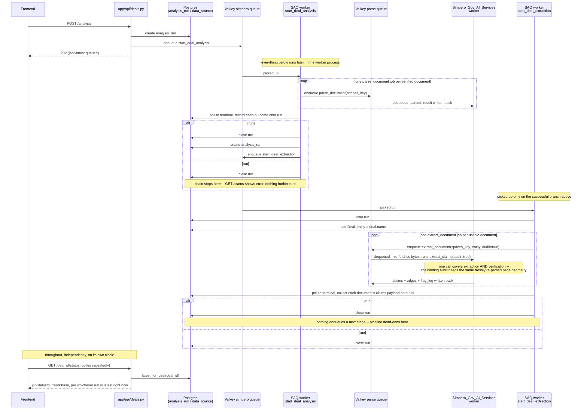

# Parsing → Extraction → Verification — Stage Chaining Plan

> **Status: recommendation, not yet approved.** Everything under "Recommended
> approach" below is Claude's proposal, reasoned from the actual code in both
> repos (see Verified findings) — not a decision Vansh has signed off on.
> Sections marked **TBD / confirm with Vansh** are real open questions, not
> filled in with a guess. Do not start building past the "Alpha-side" file
> list without those confirmed, and do not build the "Explicitly not doing"
> items under any circumstance without a separate, explicit ask.
>
> Builds on and partially **amends** `docs/plans/analysis-pipeline-job-scaffolding-services.md`
> (2026-08-11) — that doc left "is verification its own pass?" as the central
> open question; this doc proposes an answer (no) and explains why, based on
> what `verify.py`/`extract_service.py` actually need to run.

---

## Problem restatement

`analysis_run.job_name` (`'parsing'`/`'extraction'`/`'verification'`, added
2026-08-11) exists so one deal's "Start Analysis" flow can walk three real
stages. Only `parsing` is wired end-to-end today — `POST
/deals/{deal_id}/analysis` → `start_deal_analysis` → `Simpero_Gov_AI_Services`'
`"parse"` queue. Nothing creates a `job_name='extraction'` or
`'verification'` row, and nothing on the services side has a queue job for
either. This doc is what it would take to close that gap — split by which
repo owns which piece — and, separately, what I'd recommend *not* building at
all, and why.

---

## Verified findings (file:line, current state)

**Alpha (`Simpero_AI_Gov_Alpha`)**
- `app/jobs/tasks/start_deal_analysis.py:105-end` — the only place a
  `job_name='parsing'` run ever runs to completion. Its terminal branch
  (`if all_terminal or timed_out:`) writes `status`/`error_message`/
  `job_comments`, appends one `human_audit_log` row
  (`event_type="analysis_parsing_completed"`), and `return`s. Nothing after
  that `return` — no chaining exists.
- `app/repo/AnalysisRunRepo.py:9-10` — `_ACTIVE_STATUSES = ("queued",
  "in_progress")`, `_TERMINAL_STATUSES = ("successful", "failed")`.
  `job_name` is not one of `update_progress`'s writable columns (not in its
  parameter list) — confirmed append-only, set once at `create()`.
- `alembic/versions/3fd6292e23f0_analysis_run.py` — `uq_analysis_run_active`
  is `ON analysis_run (deal_id) WHERE status IN ('queued', 'in_progress')`,
  **not** `(deal_id, job_name)`. A new `extraction` row can be created for a
  deal the moment its `parsing` row leaves `('queued','in_progress')` — no
  index change needed for sequential (never concurrent) stages.
- `app/services/pipeline_steps.py:7-53` — the 9 UI phases. `"pass1" /
  "Verifying claims" / "Extracting and verifying claims against the
  source"` — this description already *is* extraction + verification,
  combined, in the frontend's own existing vocabulary. `"classify" /
  "Classifying document" / "Identifying document type and sections"` sits
  between `parsing` and `pass1` and corresponds to **none** of the three
  `job_name` values — flagged as an open question below, not resolved here.
- `app/api/deals.py`'s `_steps_for_status`/D14 mapping assumes one
  `analysis_run` row represents the whole pipeline (`successful` on a
  `parsing`-shaped row → `currentPhase="classify"`, as if the *next* phase
  lives in the same row). It doesn't know about `job_name` at all yet.

**Services (`Simpero_Gov_AI_Services`, `staging` @ `73dc4d4`)**
- `parser_service/verify.py:1-30` (module docstring) + `:124` — `audit_claim`,
  the binding audit. It's given a claim that already resolved to an exact
  span and asks whether that span justifies it — **it needs the claim and
  the page's char-geometry index (`pages`) together**, not just the claim in
  isolation.
- `parser_service/extract_service.py:559-560` — `pages` only exists as a
  side effect of `extract_claims` calling `parse_pdf_bytes(data)` itself,
  fresh, every time. There is no cheaper way to get `pages` back without
  re-parsing the raw bytes from Spaces — `parse_document`'s own output
  (a Spaces `{bucket,key}` pointer to a *different*, smaller `ParseResponse`
  shape) isn't reused by `extract_claims` either; it always starts from raw
  bytes.
- `extract_service.py:662-663` — `if audit: _audit_claims(claims,
  result.pages, flag_log, workers=workers)`. The **only** call site. Running
  the audit standalone, over an already-produced claims payload, would mean
  re-fetching the same bytes and re-deriving `pages` all over again just to
  have something to hand `audit_claim` — strictly more expensive than
  setting `audit=True` on the same `extract_claims` call that's already
  re-parsing anyway.
- `parser_service/worker.py:125-130` — `functions: [parse_document]` only.
  No `extract_document` job exists.

---

## Recommended approach

### 1. Don't build verification as a separate pass — fold it into extraction

**Recommendation:** `job_name='verification'`'s actual work should be
`extract_claims(..., audit=True)` — the *same* call extraction already
makes, not a second `verify_document` job. The finding above is the reason:
`audit_claim` needs `pages`, which only exists mid-`extract_claims`; a
standalone verify job would re-fetch and re-parse the same bytes for no
benefit over just flipping a flag on the call that's already happening.

This **resolves** the open question the earlier services-scaffolding doc
left open. It also means Alpha only has one real hop to orchestrate
(parsing → extraction), not two — simplifying point 2.

`job_name='verification'` as a *row* can still exist for observability (a
distinct thing the frontend/audit trail points at) — see "Alpha-side" below
for how, without it being a second network round-trip.

**TBD / confirm with Vansh:** this is the one recommendation in this doc
that changes what "verification" *means* product-wise (always bundled with
extraction, never independently re-runnable without re-extracting). Confirm
before building either side.

### 2. Chain inline, no reconciler

**Recommendation:** when `start_deal_analysis`'s terminal branch writes
`status="successful"`, it enqueues the extraction stage itself, in the same
worker, right after its own closing audit write. No new poller/cron.

This matches D9's own reasoning for rejecting a reconciler the first time
around ("keeps everything in one file and needs no new infrastructure") —
introducing one now for stage-chaining would contradict that same call.
Driving the chain from `GET /status` is out for the same reason D9 already
established: that route stays a pure read.

### 3. `entity` — default to `Deal.name`

**Recommendation:** the new extraction task fetches the `Deal` row (already
available via `DealRepo`) and passes `deal.name` as `extract_claims`'s
`entity`. It's the only real-world label on hand without new plumbing, and
`extract_claims`'s own docstring already treats adjacent fields like
`source_file` as debug/human-readable, not load-bearing.

**TBD / confirm with Vansh:** is `deal.name` actually the right entity label
for claim attribution, or does it need to be something else (fund name,
company legal name)?

### 4. `classify` has no `job_name` — flagged, not resolved

**Open question, not decided here:** `pipeline_steps.py`'s `classify` phase
sits between `parsing` and `pass1` but corresponds to none of `job_name`'s
three values. Two ways to handle it, neither chosen:
- Treat it as auto-`"done"` the instant an `extraction` row exists,
  regardless of that row's own status (classify becomes a free transition,
  not a tracked step).
- Add a fourth `job_name` value later if document classification ever
  becomes real, separately-tracked work.

**TBD / confirm with Vansh** before extending `_steps_for_status`.

### 5. Status mapping — extend the existing table, don't redesign it

**Recommendation:** `_steps_for_status` becomes keyed by `(job_name,
status)`, not `status` alone. Proposed mapping (pending confirmation of
points 3–4 above):

| `job_name` | `status` | `jobStatus` | `currentPhase` |
|---|---|---|---|
| `parsing` | *(unchanged from today)* | | |
| `extraction` | `queued`/`in_progress` | `processing` | `"pass1"` (current) |
| `extraction` | `successful` | `processing` | `"pass2"` (next) |
| `extraction` | `failed` | `error` | `"pass1"` (failed) |

`latest_for_deal` already does the right thing here — once an `extraction`
row exists, it's the new "latest" and this table takes over. No change
needed there.

---

## End-to-end flow (wireframe, once built)

What this would look like in full, once every item under "What needs
building" below actually exists — not what's built today. `W1`/`W2` are two
job invocations, not two processes: both run inside this app's one SAQ
worker pool, picking up different job names.

Two things this diagram makes visible that prose alone doesn't:

- **The only new decision point is the `alt` after run #1.** Everything else
  is the existing parsing flow (compressed here — see the implementation
  doc's own wireframe for its full step-by-step) or a structural repeat of
  it for extraction. There's no new kind of machinery, just one more hop.
- **The diagram has no step after "pipeline dead-ends here."** `currentPhase`
  would report `"pass2"` on a successful run #2 (per the mapping table
  above) and just sit there — `pipeline_steps.py`'s remaining five phases
  (cross-checking, governance, OFAC, drafting, scoring) have no job behind
  them yet. That gap is real, not an omission from this diagram.

---

## What needs building — Alpha (`Simpero_AI_Gov_Alpha`)

1. **`app/jobs/tasks/start_deal_analysis.py`** — in the terminal branch, on
   `final_status == "successful"`: fetch the `Deal` row, create a new
   `analysis_run` (`job_name="extraction"`, `status="queued"`), enqueue the
   new extraction task on the `"simpero"` queue, same pattern as the
   existing `analysis_requested` audit write.
2. **New task, `app/jobs/tasks/start_deal_extraction.py`**, mirroring
   `start_deal_analysis`'s shape closely:
   - Loads the run, resolves the deal, filters the **parsing** run's
     `parse_jobs` to `outcome == "parsed"` only (skip anything that came
     back `rejected`/needs OCR — no point spending an Anthropic call on a
     document parsing already flagged as unreadable).
   - Enqueues one `extract_document` job per usable document onto the
     services repo's `"parse"` queue (new `enqueue_extract_job` in
     `app/jobs/parse_client.py`, mirroring `enqueue_parse_job`), passing
     `entity=deal.name` (point 3) and `audit=True` (point 1 — this call
     covers "verification" too).
   - Same poll-to-terminal loop shape as `start_deal_analysis` (D10's
     never-hold-a-transaction-across-the-wait discipline applies here too).
   - Writes its own `job_comments` equivalent — **TBD** exact shape once the
     services side's result payload (claims/edges/flag_log) is real; likely
     needs its own summary logic, not a reuse of `_build_job_comments`
     (that one is parse-outcome-shaped, not claims-shaped).
3. **`app/jobs/tasks/__init__.py`** — register the new task.
4. **`app/api/deals.py`** — extend `_steps_for_status` per the table in
   point 5 above; `get_deal_status` needs no other change (`latest_for_deal`
   already picks up the new row once it exists).
5. **`app/repo/HumanAuditRepo`-facing event types** — reuse
   `"analysis_requested"` for the extraction row's creation (add `job_name`
   to its payload rather than inventing a new event name), add
   `"analysis_extraction_completed"` mirroring the existing
   `"analysis_parsing_completed"` for its terminal write.
6. **Tests** — a `tests/test_start_deal_extraction_job.py` mirroring
   `tests/test_start_deal_analysis_job.py`'s structure; extend
   `tests/test_start_analysis_endpoint.py`'s status-mapping tests for the
   new `(job_name, status)` combinations; extend
   `tests/test_analysis_run_rls.py` if `job_name="extraction"` rows need any
   new fixture coverage.

## What needs building — Services (`Simpero_Gov_AI_Services`)

Per the earlier handoff doc, still standing, now narrowed by point 1's
recommendation:

1. **`extract_document(ctx, *, spaces_key, entity, run_id, correlation_id,
   source_file=None, prose=False, qualitative=False,
   canonicalize_attributes=False)` in `worker.py`** — fetch bytes from
   Spaces (same path `parse_document` uses), call `extract_claims(...,
   audit=True)` always (point 1 — no separate audit flag needed at the
   queue-job level, since this job *is* "verification" too), return or
   write-to-Spaces the resulting payload.
2. **Register it**: `functions: [parse_document, extract_document]`.
3. **Its own `before_process` timeout/retries/concurrency policy** —
   **TBD**, real numbers needed, informed by Anthropic's actual latency at
   whatever concurrency the worker runs.
4. **TBD, unmeasured:** whether the `{run_id, sha256, source_file, claims,
   edges, flag_log, skipped_pages}` payload is small enough to return
   through the queue directly, or needs the same Spaces-pointer treatment
   `parse_document`'s result gets.
5. **Confirm `ANTHROPIC_API_KEY`/`ANTHROPIC_AUTH_TOKEN`** is actually present
   in the worker's runtime environment (not just wherever `POST /extract`
   runs) — `extract_claims` fails closed (`ProseCredentialMissing`) without
   it, before any parsing happens.

**No longer needed, per point 1:** the `_audit_claims`/`verify.py` refactor
to accept an externally-supplied claims payload. Don't build it.

---

## Explicitly not doing (either repo)

- **A standalone `verify_document` job or `_audit_claims` refactor.** Point
  1's finding: it would re-parse the same bytes for no benefit.
- **A generic pipeline-runner/state-machine abstraction.** Three known,
  hardcoded stages don't need one; inline chaining (point 2) is the right
  size.
- **Any change to `GET /deals/{deal_id}/status`'s response shape.** Same
  `DealStatusResponse` contract — only the internal `(job_name, status) →
  (jobStatus, currentPhase)` mapping data grows.
- **A fourth `job_name` value for `classify`** (point 4) — flagged, not
  decided, definitely not built speculatively.

---

## Open questions, collected

1. Fold verification into extraction's `audit=True`, never a separate job? (point 1)
2. `entity = deal.name` — right value? (point 3)
3. How does `classify` (no `job_name` of its own) get marked done? (point 4)
4. Extraction's result-delivery shape and timeout/concurrency numbers (services-side, unmeasured — carried over from the earlier handoff doc).
5. Is `ANTHROPIC_API_KEY` actually provisioned in the worker's real runtime environment?

Nothing under "What needs building" above should start until at least 1–3
are confirmed — each reshapes the task/job signatures in the file lists.
