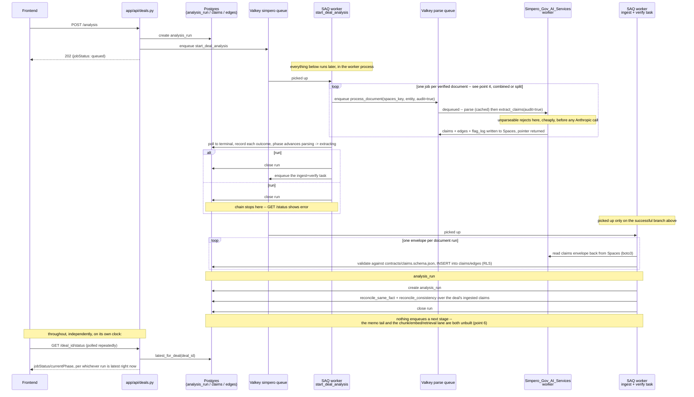

# Parsing → Extraction → Verification — Stage Chaining Plan

> **Status: Alpha-side implemented (this session), held on PR #81 pending
> merge.** Reviewed on PR #81 by `kpal002` (`Simpero_Gov_AI_Services`'
> owner), whose comment and a follow-up `stage-chaining-suggested-changes.md`
> corrected three real mistakes in the first draft and surfaced a fourth gap
> (the chunking/embedding/retrieval lane) this doc hadn't accounted for at
> all. Every correction was independently re-verified against the actual
> code in both repos before being folded in — see Verified findings.
>
> **Vansh's decisions, both confirmed:** adopt the combined `process_document`
> job (point 4) — rework PR #81 before merging, not after. And: `reconcile_
> same_fact`/`reconcile_consistency` loop per document for now (point 2's
> scope question) — the cross-document reconciliation gap stays open, named
> explicitly below, not solved.
>
> **What's actually built:** everything under "What needs building — Alpha"
> — `app/jobs/tasks/start_deal_analysis.py` reworked, new `app/jobs/tasks/
> start_deal_verification.py`, `enqueue_process_document_job` replacing
> `enqueue_parse_job`, the `_steps_for_status` mapping extended, 269 tests
> passing. **Not built:** anything under "What needs building — Services" —
> `process_document` doesn't exist in `Simpero_Gov_AI_Services` yet; see the
> companion handoff doc. Until it does, Alpha's fan-out enqueues a job name
> nothing consumes.

---

## Problem restatement

`analysis_run.job_name` (`'parsing'`/`'extraction'`/`'verification'`, added
2026-08-11) exists so one deal's "Start Analysis" flow can walk through real
stages. Only `parsing` is wired end-to-end today (PR #81, still open) —
`POST /deals/{deal_id}/analysis` → `start_deal_analysis` →
`Simpero_Gov_AI_Services`' `"parse"` queue. Nothing creates an `extraction`
or `verification` row, and — corrected understanding, see below — parsing
and extraction are two calls into the *same* cached parse, verification is
an **Alpha-only** pass over claims that don't exist in any database yet
because nothing ingests them, and there's an entire chunking/embedding/
retrieval lane this doc's first draft never mentioned. This revision is
what it would actually take to close those gaps, split by repo, with what I
still recommend *not* building, and why.

---

## Verified findings (file:line, current state — corrected)

**Services (`Simpero_Gov_AI_Services`, `staging`)**
- `parser_service/docling_parser.py:365-390` — `parse_pdf_bytes` is
  **read-through cached by SHA-256**, storing both the `PageIndex` list and
  the full `DoclingDocument`. **Correction from the first draft:** calling
  it a second time (once from `parse_document`'s `dispatch.parse_bytes`,
  once from `extract_claims`) is a **cache read**, not a second docling run
  — provided the cache is enabled, which it is whenever Spaces is
  configured (`document_cache.py:92`), which the worker already requires.
  The first draft's "re-parsing from raw bytes, fresh, every time, no
  cheaper way" claim was wrong.
- `parser_service/dispatch.py:79` and `parser_service/extract_service.py:560`
  — both call the same `parse_pdf_bytes`, confirming the cache is genuinely
  shared across the parse path and the extract path.
- `parser_service/verify.py:1-30,124` — `audit_claim`, the binding audit.
  Needs a claim and the page's char-geometry index (`pages`) together —
  this part of the first draft's reasoning still holds.
- `parser_service/extract_service.py:662-663` — `if audit:
  _audit_claims(claims, result.pages, flag_log, ...)`. The only call site.
  Folding the audit into `extract_claims(audit=True)` is still the right
  call — it needs `pages`, already in memory from the same call.
- `parser_service/extract_service.py:672-680` — `extract_claims` returns
  `{run_id, sha256, source_file, claims, edges, flag_log, skipped_pages}`.
  **This is already `POST /extract`'s real, live response shape today** —
  not a hypothetical future payload.
- `scripts/emit_claims.py:42` → `extract_claims` — the sandbox CLI already
  runs parse + extract + binding-audit in **one call, one in-memory
  parse**, no cache round-trip at all (the parse never leaves memory in
  that path).
- `parser_service/worker.py:125-130` — `functions: [parse_document]` only.
  No `extract_document`/combined job exists.
- **New finding, not in the first draft:** `parser_service/chunker.py`,
  `scripts/emit_chunks.py`, `contracts/chunks.schema.json` — a whole
  chunking/embedding pipeline lane exists on this side, entirely separate
  from claims extraction.

**Alpha (`Simpero_AI_Gov_Alpha`)**
- `app/jobs/tasks/start_deal_analysis.py:105-end` — the only place a
  `job_name='parsing'` run completes. Terminal branch writes
  `status`/`error_message`/`job_comments`, appends one `human_audit_log`
  row, `return`s. No chaining.
- `app/repo/AnalysisRunRepo.py:9-10` — `job_name` confirmed append-only
  (not in `update_progress`'s writable columns).
- `alembic/versions/3fd6292e23f0_analysis_run.py` — `uq_analysis_run_active`
  is `(deal_id) WHERE status IN ('queued','in_progress')`, not
  `(deal_id, job_name)` — still fine for sequential (never concurrent)
  stages.
- **New finding, not in the first draft:** `app/services/reconciliation.py:95`
  — `async def reconcile_same_fact(...)` (3a, SIM-371) — cross-page/
  cross-document same-fact reconciliation over **already-ingested** claims,
  writing `SAME_FACT`/`CONTRADICTS` edges.
- **New finding:** `app/services/consistency.py:146` — `async def
  reconcile_consistency(...)` (3b, SIM-372) — re-executes a computational
  claim's formula from its operand claims and compares, writing
  `DERIVED_FROM`/`CONTRADICTS` edges. Also over already-ingested claims.
- **New finding:** `scripts/ingest_claims.py` — reads a claims JSON (the
  exact shape `extract_claims` / `POST /extract` produces), validates
  against `contracts/claims.schema.json`, `INSERT`s into the `claims` table
  under RLS as `dd_app`. Dry-run by default, `--commit` to actually write.
  **This is the only thing anywhere that puts a claim in the database.**
- **New finding:** `scripts/run_verification.py` — runs
  `reconcile_same_fact` then `reconcile_consistency` in sequence over one
  tenant's already-ingested claims. Its own docstring: *"The passes existed
  and were unit-tested, but nothing ran them in sequence on real ingested
  claims until now."* Both scripts are manual CLI tools — neither is wired
  to any async/queue path.
- **New finding:** `app/services/embedding.py`, `app/services/retrieval.py`
  exist — the Alpha-side half of the chunking/retrieval lane the services
  repo's `chunker.py`/`emit_chunks.py` feed into. Entirely separate from the
  claims pipeline this doc covers.
- `app/services/pipeline_steps.py:7-53` — the 9 UI phases, unchanged
  finding: `"pass1"` ("Verifying claims / Extracting and verifying claims
  against the source") already reads as extraction + the binding audit
  combined. `"classify"` still corresponds to none of `job_name`'s values.

---

## The corrected pipeline

```
per document (parser worker):
  parse (docling, cached)  →  extract_claims(audit=True)  →  claims envelope to Spaces
      └─ unparseable → reject / ocr_needed (no Anthropic call spent)

per deal (Alpha), after every document terminates:
  read back each envelope (boto3)  →  ingest_claims into the spine (RLS)   [end of "extraction"]
      →  reconcile_same_fact + reconcile_consistency over the deal's claims   [job_name = "verification"]
      →  (chunk → embed → ingest chunks: a parallel, separate retrieval lane)
      →  [memo tail: classify → pass2-4 → governance → OFAC → scoring — unbuilt, out of scope here]
```

The first draft's diagram dead-ended at "claims written to Spaces" — one
step short of the database. This is the corrected chain; the sections below
build toward it.

---

## Recommended approach

### 1. Fold the binding audit into extraction — not "verification"

**Renamed from the first draft's "fold verification into extraction."**
`extract_claims(audit=True)` is correct — the binding audit needs `pages`,
already in memory from the same call, so a standalone parser audit job
would re-derive it for nothing. But this is the **per-claim binding audit**
(source-grounding: does this span justify this claim), not the product's
verification layer. Conflating the two was the first draft's central
mistake.

### 2. `job_name='verification'` = Alpha's 3a + 3b, not a parser call at all

**Recommendation:** a new Alpha task running `reconcile_same_fact` +
`reconcile_consistency` (`app/services/reconciliation.py:95`,
`app/services/consistency.py:146`) over the deal's **ingested** claims,
after every document has finished extraction. This is cross-document,
deal-level, and genuinely cannot be bundled into a single document's
extraction call — it needs every document's claims already in the
database. Nothing about this runs in `Simpero_Gov_AI_Services`.

### 3. Add the missing step: ingest

**Recommendation:** between extraction finishing and verification starting,
something has to read each document's claims envelope back from Spaces
(boto3 — already a dependency, per `app/jobs/parse_client.py`), validate it
against `contracts/claims.schema.json`, and `INSERT` it into `claims`/`edges`
under RLS — the same path `scripts/ingest_claims.py` already proves out
manually. Without this, `reconcile_same_fact`/`reconcile_consistency` have
nothing to run on; the `claims` table never fills regardless of what else
gets built. **This step was entirely missing from the first draft.**

### 4. Consider the combined per-document job — evaluate it, don't dismiss it

**The first draft never evaluated this option; it should have.** Because
extraction's "re-parse" is a cache read (finding above), the cost argument
for keeping parsing and extraction as two separate queue jobs is weak. The
sandbox already proves the combined shape works (`emit_claims.py:42`).
Collapsing them into one per-document `process_document` job (parse +
`extract_claims(audit=True)` in one call) would delete:
- the extra Alpha-side orchestration hop (chaining `start_deal_analysis` →
  a separate extraction task),
- the Spaces cache round-trip (the parse stays in memory, as it does in
  the sandbox today),
- the duplication between `parse_document`'s `ParseResponse` pointer and
  extraction's separately-cached `DoclingDocument`.

The three reasons a split existed all survive the merge:
- **Status phases** (parsing → extracting) become a `phase` field on
  `analysis_run`, advanced from inside the one job — two queue jobs were
  never required for two UI-visible phases.
- **The raw-parse artifact** (whatever reads `ParseResponse` for the
  frontend's parser-verification view) still gets emitted; the combined
  job parses regardless.
- **Early-reject/`ocr_needed`** still happens first, cheaply — `parse_pdf_bytes`
  runs before any Anthropic call, inside `extract_claims` itself.

**Tradeoff, explicit:** docling is memory-heavy, hence the parser's
`concurrency: 1` (`worker.py:129`) — a deal's documents extract *serially*
in the combined shape, where a separate I/O-bound extract worker could in
principle parallelize across documents. Immaterial at current scale (a
handful of documents per deal); if extraction ever becomes the actual
throughput bottleneck, split it out then — the SHA-256 cache makes that
split cheap to do later, which is exactly why it's not worth pre-building
now.

**TBD / confirm with Vansh:** adopt the combined job, or keep the split and
write down why (see "Impact on already-shipped code" — this is the one
choice that reworks what's already written, not just adds to it).

### 5. `entity` — default to `Deal.name` (unchanged from the first draft)

Still the only real-world label available without new plumbing.
**TBD / confirm with Vansh:** is `deal.name` the right attribution label?

### 6. Name the other unbuilt lanes — don't imply three stages is the whole pipeline

**Correction from the first draft**, which called parsing/extraction/
verification "three known, hardcoded stages" without naming what's missing
around them. Two separate gaps, neither addressed by anything in this doc:
- **The memo tail**: `classify` and `pipeline_steps.py`'s `pass2` through
  `finalize` (cross-checking, governance, OFAC, drafting, scoring) — no job
  exists for any of them.
- **The chunking/embedding/retrieval lane**: `parser_service/chunker.py` /
  `scripts/emit_chunks.py` / `contracts/chunks.schema.json` on the services
  side, `app/services/embedding.py` / `app/services/retrieval.py` on
  Alpha's — a parallel branch off the same parsed document, feeding search/
  citation rather than claims. Entirely separate from everything else in
  this doc; not touched by any recommendation here.

Nothing here proposes building either. This section exists so "done with
this doc" doesn't get mistaken for "the pipeline is complete."

### 7. Result delivery — Spaces pointer, decided, not open

**Correction from the first draft**, which left this as an unmeasured open
question. It doesn't need measuring: a real filing's `claims`/`edges`/
`flag_log` payload is large (hundreds of claims for one real document), and
the payload shape is already known — `extract_service.py:672-680`, the
same one `POST /extract` returns today. Mirror `parse_document`: write the
payload to Spaces, return a `{bucket, key}` pointer through the queue.
Removed from "Open questions" below.

---

## End-to-end flow (wireframe, revised)



What changed from the first draft's diagram: the per-document loop now
parses *and* extracts *and* audits in one pass (point 4, pending
confirmation); a real ingest step exists between extraction and
verification (point 3); verification is Alpha reconciling ingested claims,
not a parser call (point 2); and the dead-end note at the bottom now names
*two* separate unbuilt things rather than one vague "five more phases."

---

## What needs building — Alpha (`Simpero_AI_Gov_Alpha`) — done

1. **`app/jobs/tasks/start_deal_analysis.py`** — on `status="successful"`,
   creates a `job_name="verification"` run and enqueues
   `start_deal_verification`, inline, same worker, no reconciler. No
   `job_name="extraction"` row is ever created — extraction is folded into
   this same job's per-document call (point 4). Fan-out now calls
   `enqueue_process_document_job(storage_key, entity=deal.name)`.
2. **No `phase` column, in the end.** Alpha can't observe genuine
   sub-progress inside one opaque remote call — the combined job is
   all-or-nothing from the caller's side — so there was nothing for a
   `phase` field to track that `job_name` + `status` didn't already cover.
   `job_name` stays fixed at `"parsing"` for the whole call;
   `job_name="extraction"` is confirmed unused.
3. **`app/jobs/tasks/start_deal_verification.py`** (new) — reads back each
   document's claims envelope from Spaces
   (`app/services/uploads/spaces.py::get_json_object`, new), validates
   against `contracts/claims.schema.json`, inserts `Claim`/`Edge` rows
   under RLS with real `deal_id`/`data_source_id` (the async equivalent of
   `scripts/ingest_claims.py`, one transaction, no dry-run) — then loops
   per `data_source_id` calling `reconcile_same_fact` + `reconcile_consistency`
   (per Vansh's "loop per document, for now" answer — see Open Questions).
4. **`app/jobs/tasks/__init__.py`** — `start_deal_verification` registered.
5. **`app/api/deals.py`** — `_steps_for_status` now keyed by `(job_name,
   status)`: `parsing`+`successful` → `pass2` (next), `verification`
   queued/in_progress → `pass2` (current), `verification`+`successful` →
   `governance` (next), `verification`+`failed` → `pass2` (failed).
6. **`HumanAuditRepo` event types** — `analysis_verification_completed`
   added, mirroring `analysis_parsing_completed`; the verification run's
   own creation reuses `analysis_requested` with `job_name` in its payload.
7. **Tests** — `tests/test_start_deal_verification_job.py` (new, exercises
   the real `reconcile_same_fact` against genuinely ingested claims, not a
   mock — proved a real cross-page `same_fact` edge gets written), plus
   reworked coverage in `test_start_deal_analysis_job.py` and
   `test_start_analysis_endpoint.py` for the new enqueue signature and
   status mapping. **269 tests passing**, `pyright` clean, verified against
   a fresh `docker-compose.dev.yml` stack.

## What needs building — Services (`Simpero_Gov_AI_Services`) — not started

Alpha's fan-out already enqueues `"process_document"` — the name is no
longer TBD, it's what `enqueue_process_document_job` actually sends. Full
detail in the companion handoff doc,
`docs/plans/analysis-pipeline-job-scaffolding-services.md` (rewritten to
match the shipped Alpha contract). Summary:

1. **A `process_document` job in `worker.py`** — fetch bytes from Spaces (same path `parse_document`
   uses), call `extract_claims(..., audit=True)` — **always** `audit=True`,
   since the binding audit is now permanently folded in, not a caller
   option. If point 4 is adopted, this *replaces* `parse_document` for
   Alpha's purposes rather than sitting alongside it — see "Impact on
   already-shipped code."
2. **Register it** in `functions`.
3. **Its own `before_process` timeout/retries/concurrency policy** — real
   numbers, informed by Anthropic's actual latency; `concurrency: 1` stays
   for the reason in point 4's tradeoff (docling is memory-heavy) unless
   measured otherwise.
4. **Result delivery: Spaces pointer** (point 7 — decided, not TBD).
5. **Confirm `ANTHROPIC_API_KEY`/`ANTHROPIC_AUTH_TOKEN`** is present in the
   worker's actual runtime environment, not just wherever `POST /extract`
   runs.

**Still not needed, confirmed twice now:** any `_audit_claims`/`verify.py`
refactor to accept an externally-supplied claims payload.

---

## Explicitly not doing (either repo)

- **A standalone *parser* `verify_document` job, or a `_audit_claims`
  refactor to run the binding audit over an already-produced claims
  payload.** Scoped precisely per the review: this is about the parser's
  binding audit specifically. It does **not** mean skipping 3a/3b — those
  are real, separate, already-built Alpha work that must still get wired up
  (points 2–3).
- **A generic pipeline-runner/state-machine abstraction.** The known stages
  don't need one; inline chaining is the right size.
- **Any change to `GET /deals/{deal_id}/status`'s response shape.** Same
  `DealStatusResponse` contract — only the internal mapping data grows.
- **Building the memo tail or the chunk/embed/retrieval lane** (point 6) —
  named so they're not mistaken for in-scope, not started here.

---

## Impact on already-shipped code (PR #81, still open — read before touching)

PR #81 is **open, not merged** — nothing here is live in production. But it
is a complete, tested (263 passing), working implementation of the
parsing-only flow, and point 4 (the combined per-document job) would rework
core pieces of it, not just add alongside it:

- `app/jobs/tasks/start_deal_analysis.py` — the fan-out call
  (`enqueue_parse_job`) and the outcome-recording logic (`_apply_outcome`,
  `_build_job_comments`/`_comment_for_job`) are all shaped around a
  parse-only outcome (`"parsed"`/`"rejected"` + a bucket/key pointer). A
  combined job's result additionally carries a claims payload on success —
  the polling/outcome logic would need real changes, not just new fields
  bolted on.
- `app/jobs/parse_client.py::enqueue_parse_job`/`get_parse_job` — would
  need new parameters (`entity`, `audit`) or a parallel function, and
  Alpha's queue contract with the services repo changes shape either way.
- `app/models/analysis_run.py` + `alembic/versions/3fd6292e23f0_analysis_run.py`
  — a new `phase` column, and the open mechanic in "What needs building —
  Alpha" point 2 about whether `job_name` itself ever moves.
- `app/repo/AnalysisRunRepo.py::update_progress` — a `phase` parameter.
- `app/api/deals.py::_steps_for_status` and the D14 mapping table.
- `tests/test_start_deal_analysis_job.py`, `tests/test_analysis_run_rls.py`,
  `tests/test_start_analysis_endpoint.py` — all would need real rework, not
  just extension.
- `docs/implementations/2026-08-10-start-analysis-flow-alpha.md` — the
  "Column/vocabulary revisions" and "Valkey contract" sections describe the
  shipped parsing behavior in detail; another revision pass would be
  needed if point 4 lands.

**Two ways to sequence this, neither chosen here:**
- **Merge PR #81 as-is** (parsing-only, as already built and reviewed),
  then bring the combined-job shape in as a follow-up PR once point 4 is
  confirmed — avoids reworking a nearly-done, already-tested PR mid-review.
- **Hold PR #81**, resolve point 4 first, rework it before merging — avoids
  ever shipping the split shape at all if the combined shape is the real
  target.

This is a sequencing decision, not a technical one — flagging it rather
than picking one.

---

## Open questions, revised

1. ~~Adopt the combined `process_document` job?~~ **Resolved: yes.** PR #81
   held and reworked before merge, not after (Vansh's call).
2. ~~Does `job_name` stay fixed, or move partway through?~~ **Resolved:
   stays fixed.** No `phase` column was needed in the end — Alpha can't
   observe genuine sub-progress inside one opaque remote call anyway (the
   combined job is all-or-nothing from the caller's side), so
   `_steps_for_status` just maps `job_name="parsing"` + `status="successful"`
   straight to `"pass2"` instead of `"classify"`. `job_name="extraction"`
   is confirmed unused — never created anywhere, left in the `CHECK`
   constraint harmlessly.
3. ~~`job_name='verification'` = the Alpha 3a/3b task?~~ **Resolved: yes,
   implemented** (`start_deal_verification.py`). **New finding during
   implementation, not previously known:** `reconcile_same_fact`/
   `reconcile_consistency` are scoped to one `data_source_id` each, not a
   deal — neither does cross-document reconciliation as written. **Vansh's
   call: loop per document, for now.** The cross-document gap (a fact
   reported in two different filings for the same deal is never caught) is
   real and open, not solved by anything built this session.
4. `entity = deal.name` — right label for claim attribution? Implemented as
   the default (point 5); still unconfirmed whether it's the *right* one.
5. Where do chunking/embedding/retrieval fit relative to this chain — same
   trigger point, a parallel branch, something else? (point 6 — still
   entirely unbuilt, not started)
6. `classify` and the memo tail (`pass2` → `scoring`) — which stages, which
   repo, when? (point 6, still unbuilt)
7. Is `ANTHROPIC_API_KEY`/`ANTHROPIC_AUTH_TOKEN` actually provisioned in the
   worker's real runtime environment? Still unconfirmed — blocks
   `process_document` from ever succeeding once built, not just a nice-to-know.

Everything under "What needs building — Alpha" is done (see the status note
at the top). "What needs building — Services" has not been started by this
session — that's the companion handoff doc's job now.
